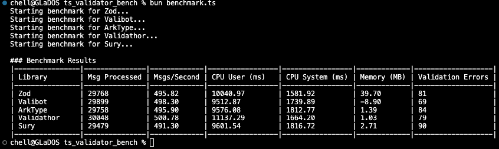

# Typescript Validation Library Benchmark

## Introduction & Background

This repo was created at the request of an [X post](https://x.com/FabianHiller/status/1942231856176595402) which was a response to a [previous post](https://x.com/NeoterismoiTaki/status/1942191026887688248). Here is the original post:

> I benchmarked @arktypeio, @valibot and @colinhacks against each other for my use-case using @bunjavascript.
> 
> What is my use-case?
> - Validating ~500 messages per second from a Mosquitto (MQTT) server.
> - The schema of the messages is pretty simple (max 3 levels of nesting).
> - Everything is executed on the server.
> 
> How did I build the benchmark?
> - I had no previous experience with any of the libraries.
> - I went through the documentation of each library and converted my types to their types.
> - Then I funneled all the messages for validation.
> 
> Who won?
> Everybody won. But mostly @arktypeio and @valibot. I didn't like the fact that zod uses way more memory than the others.
> 
> Notes, key takeaways & thoughts
> - It took me a bit longer to make @arktypeio work. I don't know why, but their syntax seemed a bit more foreign to me. That being said, I didn't spend any time trying to dive deeply into their tooling.
> - I used to avoid doing runtime validations because I thought that it will be a huge performance hit (especially with hundreds, scaling up to thousands of messages per second). Apparently I was wrong.
> - I have no idea if @bunjavascript is to "blame" for the stellar performance by all contenders, but if there is enough interest, I might test it with nodejs.
> - As I understand it, @arktypeio is specifically designed to handle more complex objects and my benchmark might not be a good indication of the gains that you'll get in more complex scenarios.
> - On the other hand, @valibot values small library size which should make it ideal for the frontend. I will be putting their claims to the test on my next benchmark.
> - The main takeaway is this: you should (almost) always do runtime validation on the server.

## Thanks

I'd like to thank [@Kosai106](https://github.com/Kosai106) for cleaning up the code and making the benchmark more readable and extensible. 

He included his own library, [ValidaThor](https://github.com/nordic-ui/ValidaThor), in the benchmark which is included in the latest results.

He also made it super simple for someone to add their own library to the benchmark.

## Future Plans

Since the MQTT server that broadcasts the messages is private, it's not possible for people to run the benchmark by themselves. However, if/when new validation libraries are added, I will be running them against the MQTT server and posting the results here.

The one thing that was made clear to me was that, even though at first glance my scenario seems to be a daunting one for runtime validation, all libraries seem to handle it with ease and no major performance hits.

In the future, the amount of messages that are broadcasted by the MQTT server will increase as more devices are connected to the network, but I don't expect any major changes in the results.

However, the next thing that I want to benchmark is the performance of the validation libraries when they are used on the client side. I am already processing a large number of messages via Bun's WebSocket API and I would like to put all the libraries to the test.

## Contribute

You can contribute to this project in a number of ways:

1. Add your validation library. The initial benchmark can be considered a baseline for a real-life scenario where your library can easily process the messages that are broadcasted by the MQTT server.
2. If you have any ideas about how to improve the benchmark, you can open an issue. Since this benchmark was put together rather hastily in an effort to evaluate the options for my own use-case, I am open to suggestions on how to improve it. This includes (but is not limited to) things like: better metrics, better measurement methods etc.
3. You can always reach me via the [issue queue](https://github.com/f1234k/ts-validator-bench/issues) or my [X Account](https://x.com/NeoterismoiTaki).

## Results

| Library        | Msg Processed | Msgs/Second | CPU User (ms)   | CPU System (ms) | Memory (MB) | Validation Errors |
|----------------|---------------|-------------|-----------------|-----------------|-------------|-------------------|
| Zod            | 29768         | 495.82      | 10040.97        | 1581.92         | 39.70       | 81                |
| Valibot        | 29899         | 498.30      | 9512.87         | 1739.89         | -8.90       | 69                |
| ArkType        | 29758         | 495.90      | 9576.08         | 1812.77         | 1.39        | 84                |
| Validathor     | 30048         | 500.78      | 11137.29        | 1664.20         | 1.03        | 79                |
| Sury           | 29479         | 491.30      | 9601.54         | 1816.72         | 2.71        | 90                |

### Notes

1. Don't pay too much atttention to the exact amount of messages or validation errors. Since this is
  a real-life scenario, the number of messages that are broadcasted by the MQTT server can vary in a
  1-minute window. Same goes for Validation errors. If you see a library having processed around 500
  messages, it means that it has handled all messages with ease.
2. The RAM usage may be negative. This practically means that when the specific library's run
  started, there was some memory being used from the previous library's run that got garbage 
  collected.